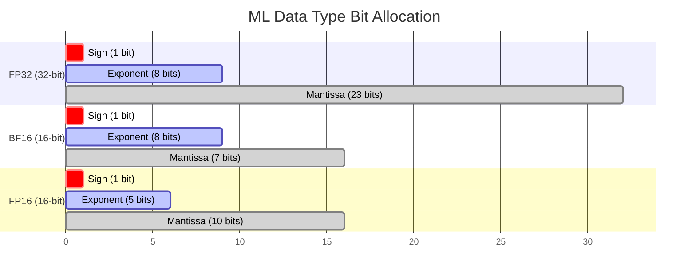

---
### Base-2 conversion

### IEEE 754 Standard

$$\text{Value} = (-1)^{\text{Sign}} \times (1 + \text{Fraction}) \times 2^{(\text{Exponent} - \text{Bias})}$$
- known as 

```mermaid
gantt
    title ML Data Type Bit Allocation
    dateFormat X
    axisFormat %s
    
    section FP32 (32-bit)
    Sign (1 bit)       :crit, 0, 1
    Exponent (8 bits)   :active, 1, 9
    Mantissa (23 bits)  :done, 9, 32

    section BF16 (16-bit)
    Sign (1 bit)       :crit, 0, 1
    Exponent (8 bits)   :active, 1, 9
    Mantissa (7 bits)   :done, 9, 16

    section FP16 (16-bit)
    Sign (1 bit)       :crit, 0, 1
    Exponent (5 bits)   :active, 1, 6
    Mantissa (10 bits)  :done, 6, 16
```

