### IEEE 754 Standard
- def: how computers represent decimal numbers in binary. All hardware follows this so values stay consistent across machines

$$\text{Value} = (-1)^{S} \times (1 + 0.M) \times 2^{(E - \text{B})}$$
- **S (Sign)**: 1 bit for +/-
- **M (Mantissa / Fraction)**: controls **precision** — # of distinct val can represent in an interval
	- M = fractional binary bits; eg. $1.00100000_2 = 1.125_{10}$
	- More M bits → finer granularity
- **E (Exponent)**: controls **magnitude** — like a zoom range
	- more E bits → can represent both very large and very tiny numbers
- **B (Bias)**: fixed offset so $2^{E−Bias}$ can produce large | tiny values, while keeping E positive
	- Bias ≈ half of max E -> so $2^{E−Bias}$ split roughly even btw neg & pos exponent (large & tiny) while having E always positive
	- Q: why add bias instead having a sign bit for neg. exponent?
		- hardware optimization for fast comparison and sorting
		- can always compare values from <span style="color:rgb(255, 0, 0)">left-to-right</span> 
			-> if neg, need to compare right to left, slower comparison
### Common Dtypes
- <span style="color:rgb(255, 0, 0)">FP32</span> is the gold standard — most stable for training (no need FP64)
- Pure low-precision training (even <span style="color:rgb(255, 0, 0)">BF16</span>) is risky → use **mixed precision** with:
   - higher precision (FP32) for values that **accumulates** (eg. optimizer, gradient)                         
   - less precision for simpler/**transitory暫時** part (eg. FF net layer)

```mermaid
gantt
    title ML Data Types
    dateFormat X
    axisFormat %s

    section FP32
    S(1)   :crit,   0, 1
    E(8)   :active, 1, 9
    M(23)  :done,   9, 32

    section BF16
    S(1)   :crit,   0, 1
    E(8)   :active, 1, 9
    M(7)   :done,   9, 16

    section FP16
    S(1)   :crit,   0, 1
    E(5)   :active, 1, 6
    M(10)  :done,   6, 16

    section FP8 (E4M3)
    S(1)   :crit,   0, 1
    E(4)   :active, 1, 5
    M(3)   :done,   5, 8

    section FP8 (E5M2)
    S(1)   :crit,   0, 1
    E(5)   :active, 1, 6
    M(2)   :done,   6, 8

    section FP4
    S(1)   :crit,   0, 1
    E(2)   :active, 1, 3
    M(1)   :done,   3, 4

    section INT8
    Int(8) :active, 0, 8
```



| Dtype    | Use Case                               | Pros                          | Cons                                                                                                                                              |
| -------- | -------------------------------------- | ----------------------------- | ------------------------------------------------------------------------------------------------------------------------------------------------ |
| FP32     | Default training (single precision)    | most stable                   | 2× memory vs FP16, slow                                                                                                                           |
| BF16     | Large model training                   | Same range as FP32, 2× faster | Much less precision (7 vs 23 M bi                                                                                                                 |
| FP16     | Mixed-precision training, inference    | Better resolution than BF16   | Smaller range → overflow/underflow                                                                                                                |
| FP8 E4M3 | Forward pass, inference (H100+)        | 4× smaller than FP32          | Very low resol                                                                                                                                    |
| FP8 E5M2 | Backward pass / gradients (H100+)      | More range than E4M3          | Minimal reso                                                                                                                                      |
| FP4      | Inference quantization (Nvidia- nvfp4) | 8× smaller than FP32     <br>* only have these repr: -6, ..., -0.5, 0.0, 0.5, 1.0, 1.5, 2, 3, 4, 6<br>* can add **a sep scale factor** can represent more than these vals <br>->  |
| INT8     | Post-training inference quantization   | Fast integer math, 4× smaller | No decimals, requires cal                                                                                                                         |
### Demo smaller bits issue
- floating-point arithmetic in GPU exhibits **non-associativity**
	- why? Mantissa cannot have infinite bits (especially BF16)
	- eg. $(a+b) + c \neq a + (b+c)$ (huge number + tiny number -> tiny number disappear)
- **overflow/underflow**: 
	- value exceed max/min -> results silently became <span style="color:rgb(255, 0, 0)">Inf, 0, nan</span> (especially FP16)
	- might need to **saturation** (hit Inf or 0 and stuck there)

****

### Memory Quick Math
- 1 byte = 8 bits
- Memory per parameter: `bits ÷ 8 = bytes`
- Total model memory: `params × bytes_per_param`

$$\text{Memory (GB)} = \frac{\text{params (B)} \times \text{bits per param}}{8}$$

e.g., 7B model in FP16: `7 × 16 / 8 = 14 GB`
e.g., 7B model in FP32: `7 × 32 / 8 = 28 GB`
e.g., 7B model in INT8: `7 × 8 / 8 = 7 GB`

### Binary (二進位)
Each position doubles from right to left — add where there's a `1`:

```
Position:  16  8  4  2  1
Binary:     1  0  1  0  1  → 16 + 4 + 1 = 21
```

- `1111` = $2^4 - 1$ = 15
- `1000` = $2^3$ = 8