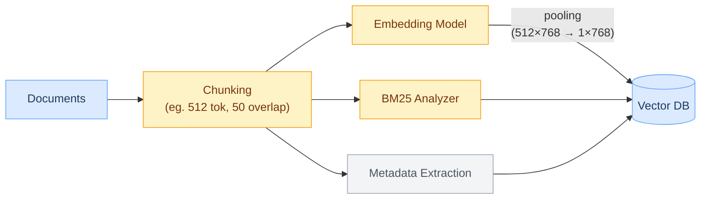
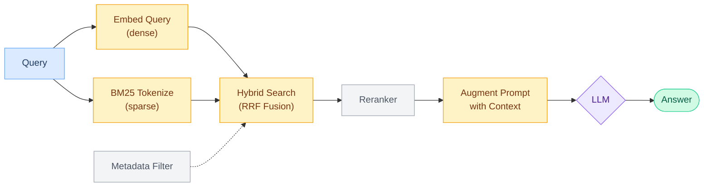

## Procedure

### 1. Indexing/DB creation
- Common metadata: `source` (filename/URL), `page`, `date`, `section`, `tags`, `doc_type`


### 2. Retrieval -> Augment -> Generation



---
## Why "Dense" and "Sparse"

The names come from the literal vector representation:

- **Dense**: text compressed into a fixed-size latent vector (e.g. 768 dims). Every dimension is non-zero, encoding a learned semantic feature. Compact but not interpretable — each dim is a latent characteristic, not a word
- **Sparse**: conceptual vector length = vocabulary size (~30,000 dims). Only terms present in the text get non-zero weights — most dims are 0, hence "sparse." In practice, only non-zero entries are stored (inverted index)

---
## Retrieval

### Intuition
- **Dense** = semantic meaning. "car" matches "automobile" because they land near each other in embedding space
- **Sparse** = exact word match. "CVE-2024-1234" only finds docs containing that exact string
- **Why both**: dense misses rare terms/IDs; sparse misses paraphrasing. Hybrid covers both failure modes

### Dense Retrieval (Bi-Encoder)

**Bi-encoder**: one encoder, run twice (once on query, once on doc), then cosine similarity between the two output vectors.

Query and docs independently encoded → cosine similarity search (**angle** between two vec — direction only, magnitude ignored)

$$\text{cosine}(\vec{q}, \vec{d}) = \frac{\vec{q} \cdot \vec{d}}{\|\vec{q}\| \|\vec{d}\|}$$

- Only cares about **direction**, not magnitude — magnitude just means repeated text, but each dim encodes a semantic characteristic
- Vectors often normalized to unit length → cosine = dot product
- **HNSW**: multi-layer navigable graph for approximate nearest neighbor; greedy walk from coarse (top) to fine (bottom) layer — O(log N) instead of brute-force O(N)

### Sparse Retrieval

**BM25**: exact word-match frequency, normalized by doc length & down-weighted by how common the word is across the corpus

**SPLADE / uniCOIL**: NNET that learns term importance weights — same inverted-index infrastructure as BM25, but with learned term expansion (activates related words not in the original text)

### Hybrid Search

Most common: **Reciprocal Rank Fusion (RRF)** — rank-based, parameter-free:

$$\text{RRF score}(d) = \frac{1}{k + \text{rank}_{\text{dense}}(d)} + \frac{1}{k + \text{rank}_{\text{sparse}}(d)}, \quad k = 60$$

where $d$ is a candidate document, $\text{rank}_{\text{dense}}(d)$ is its position in the dense retriever's ranked list, $\text{rank}_{\text{sparse}}(d)$ in the sparse list. Docs appearing in both top-k get boosted. No score calibration needed — just ranks.

---

## Post-Retrieval Reranking

**Motivation**: bi-encoder runs query and doc *separately* — tokens never interact, only compressed vectors are compared — fast but imprecise.

### Cross-Encoder Reranker

Concat query + doc into one input so self-attention **captures token-to-token relationships**:
```
Input:  [CLS] "what" "causes" "fever" [SEP] "Infections" "trigger" "fever" [SEP]
          ↓      ↓       ↓        ↓      ↓        ↓           ↓         ↓      ↓
    ┌─────────────────────────────────────────────────────────────────────────┐
    │  BERT self-attention sees all token-to-token relationships directly     │
    └─────────────────────────────────────────────────────────────────────────┘
          ↓
Output: [CLS] hidden → Linear(768→1) → sigmoid → 0~1 (relevance score)
```
- O(n) forward passes for n candidates → only run on top-20~50 from retriever
- e.g. `cross-encoder/ms-marco-MiniLM-L-6-v2` (22M params, ~200ms/20 pairs CPU)

### LLM Listwise Reranker (RankGPT)
> Ref: [RankGPT](https://github.com/sunnweiwei/rankgpt)

LLM outputs a permutation (ordering) of passage IDs rather than individual scores
```
System: You are RankGPT, an intelligent assistant that can rank passages
        based on their relevancy to the query.

User:   I will provide you with {num} passages, each indicated by number
        identifier []. Rank the passages based on their relevance to
        query: {query}.

[1] {passage_1}
[2] {passage_2}
...
[n] {passage_n}

Search Query: {query}.
Rank the {num} passages above based on their relevance to the search
query. The passages should be listed in descending order using
identifiers. The most relevant passages should be listed first.
The output format should be [] > [], e.g., [1] > [2].
Only response the ranking results, do not say any word or explain.
```
- **Sliding window**: when too many passages to fit in context at once, rank in overlapping batches — best passages bubble up through successive rounds
- strong but cost more
- Can distill to a small model (DeBERTa) via RankNet loss on LLM-predicted permutations
- should randomly reorder passages to avoid model bias

### MMR (Maximal Marginal Relevance)
Reduces redundancy in retrieved set — trades off relevance vs. diversity:

$$\text{MMR}(d_i) = \lambda \cdot \text{sim}(\vec{q}, \vec{d_i}) - (1-\lambda) \cdot \max_{d_j \in S} \text{sim}(\vec{d_i}, \vec{d_j})$$

where $d_i$ is the next candidate to consider, $S$ is the set of already-selected passages, $\vec{q}$ is the query vector:
- λ=1: pure relevance (may return near-duplicate passages)
- λ=0: pure diversity (may lose relevant content)
- λ=0.5–0.7: typical — avoids wasting context window on redundant chunks
